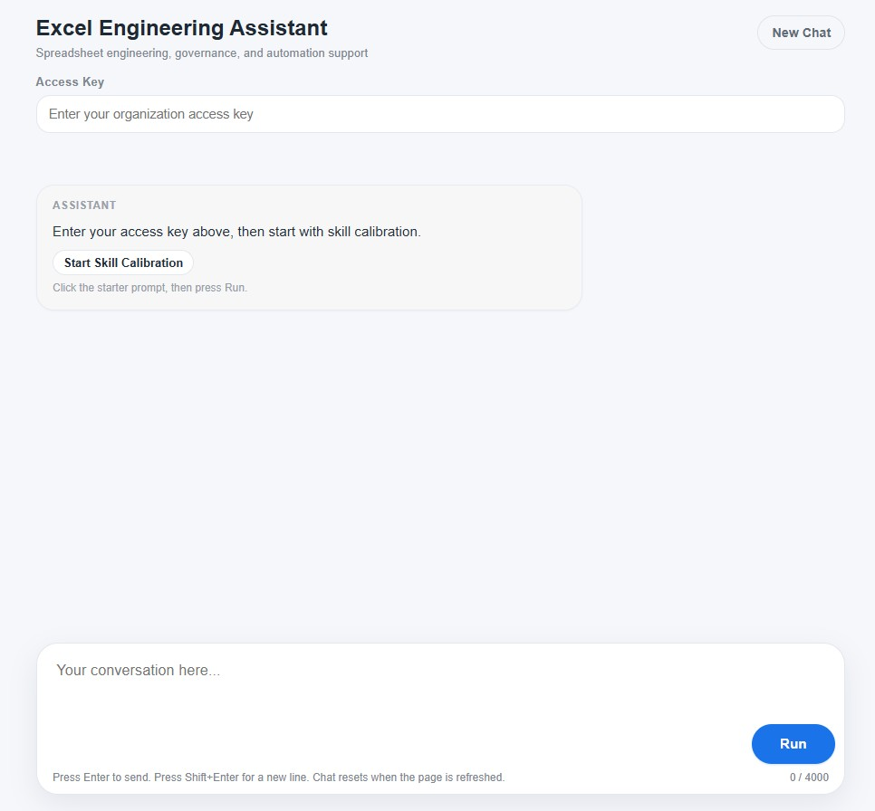

# Excel AI Governance Assistant

LLM workflow orchestration system designed to produce reliable, controlled outputs for Excel engineering and automation tasks.

---

## Application Demo

Short public-safe demonstration of the application interface and workflow behavior.

[View Demo Video](assets/demo/excel-ai-governance-demo.mp4)

---

## Problem

Using LLMs for complex spreadsheet work is unreliable.

Common failure points:
- Hallucinated formulas or incorrect logic  
- Loss of structure across multi-step tasks  
- Inconsistent outputs between runs  
- Silent data corruption or incorrect transformations  

This makes LLMs difficult to trust in real operational workflows.

---

## Solution

This project introduces a **controlled execution system** that governs how an LLM is used during spreadsheet engineering tasks.

Instead of relying on freeform prompting, the system enforces:

- Structured intake before execution  
- Step-by-step workflow progression  
- Validation gates before advancing  
- Diagnostic recovery when failures occur  

The goal is to transform LLM usage from **unpredictable interaction** into **reliable system behavior**.

---

## System Overview

## Application Interface

The system is built as a layered architecture:

### 1. Application Layer
- Web-based interface for user interaction  
- Access control and session handling  
- API communication with LLM services  

### 2. Control Layer
- Master prompt defining system behavior  
- Execution protocol governing interaction flow  
- Constraints to reduce hallucination and drift  

### 3. Workflow Layer
- Intake → Structure Lock → Controlled Build → Validation → Diagnostic Recovery  
- Stage isolation to prevent premature execution  
- Explicit validation checkpoints before progression  

---

## Code Review Guide

This repository includes sanitized implementation code to demonstrate application structure and development capability while protecting the proprietary prompt architecture.

### Files to Review

| File | What It Demonstrates |
|---|---|
| `src/Code.gs` | Server-side request handling, access validation, rate limiting, session cache usage, API request structure, and error handling |
| `src/Index.html` | Frontend interface structure, user input handling, response rendering, code block display, copy-button behavior, loading state, and mobile-responsive layout |

### What Is Not Included

The protected prompt system, internal governance architecture, and proprietary workflow logic are intentionally omitted. The published code demonstrates implementation capability without exposing the system’s unique control architecture.

## Key Capabilities

- Controlled multi-step LLM execution  
- Validation-driven workflow design  
- Failure detection and recovery logic  
- Reduction of hallucination and output drift  
- Structured problem-solving for spreadsheet engineering  

---

## Technology Stack

### Frontend
- HTML
- CSS
- JavaScript

### AI Integration
- OpenAI API
- Structured prompt orchestration
- Controlled AI workflow design

### Application Features
- Session management
- Access control
- Rate limiting
- Workflow state handling

### Workflow Focus
- Spreadsheet engineering support
- AI-assisted Excel workflows
- Validation-oriented execution
- Reliability-focused automation

## Example Use Cases

- Excel formula development  
- VBA automation support  
- Data cleanup and normalization  
- Operational reporting workflows  
- Structured spreadsheet builds  

---

## What This Demonstrates

- LLM workflow orchestration  
- AI systems design for reliability  
- Prompt architecture with behavioral control  
- Validation and failure-handling design  
- Real-world application of AI in technical workflows  

---

## Project Status

This repository is a **public-safe version** of a working system.

To protect intellectual property and sensitive logic:

- Full prompt systems are not published  
- Backend implementation details are partially abstracted  
- Examples and diagrams will be added to demonstrate behavior  

---

## Next Steps

- Add system architecture diagram  
- Add sanitized workflow examples  
- Add sample input/output demonstrations  
- Add demo screenshots of application interface  

---

## Recruiter Quick View

**What this is:**  
A system that makes AI usable for real technical work.

**What it proves:**  
- Ability to design controlled AI workflows  
- Understanding of LLM failure modes  
- Experience building structured, repeatable systems  

**Where to look first:**  
- System Overview  
- Key Capabilities  
