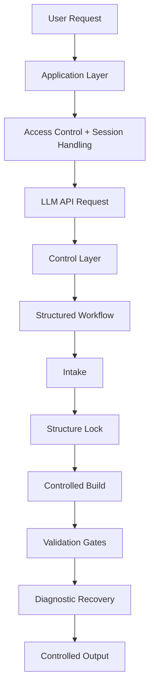

# System Architecture

The Excel AI Governance Assistant is organized as a three-layer AI workflow system.

## Layer Summary

### Application Layer
Handles user interaction, session continuity, access control, and API communication.

### Control Layer
Defines the system behavior, response discipline, workflow rules, and failure-control logic.

### Workflow Layer
Guides the user through intake, structure confirmation, staged execution, validation, and recovery.

## Public Safety Note

This document explains the system architecture without exposing protected prompt logic, credentials, backend implementation details, or proprietary workflow rules.
